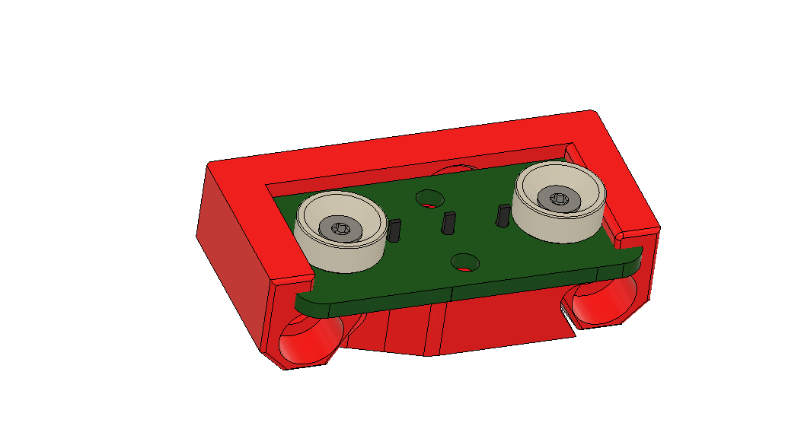
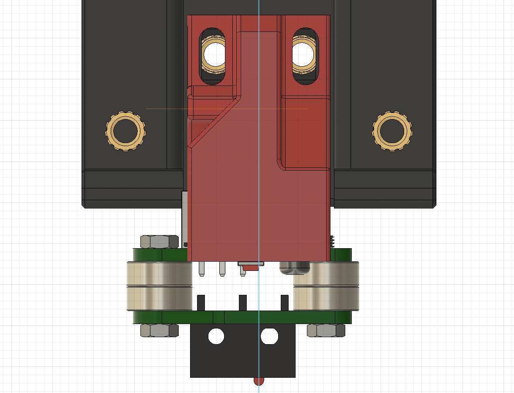
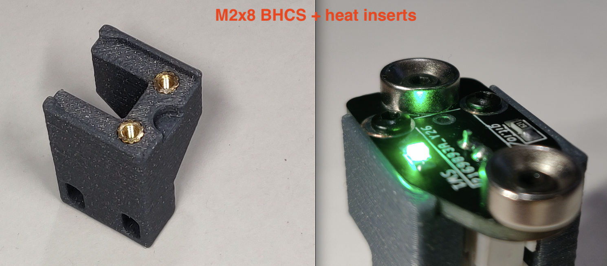
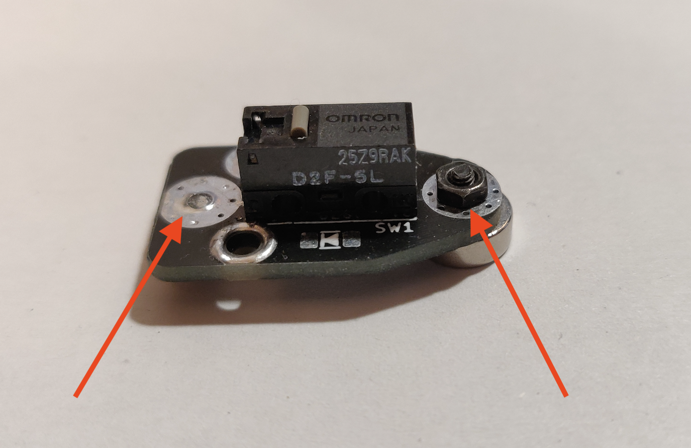
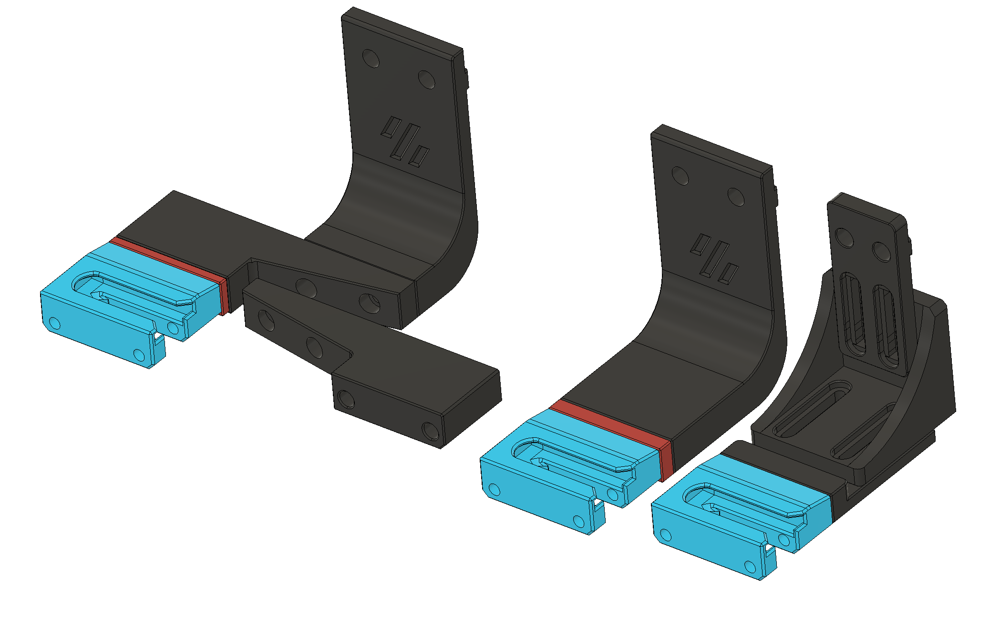
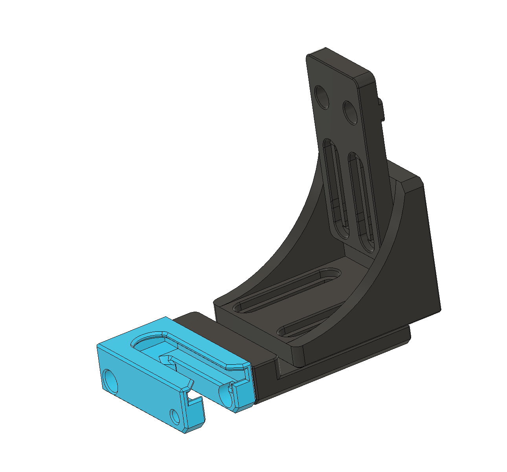
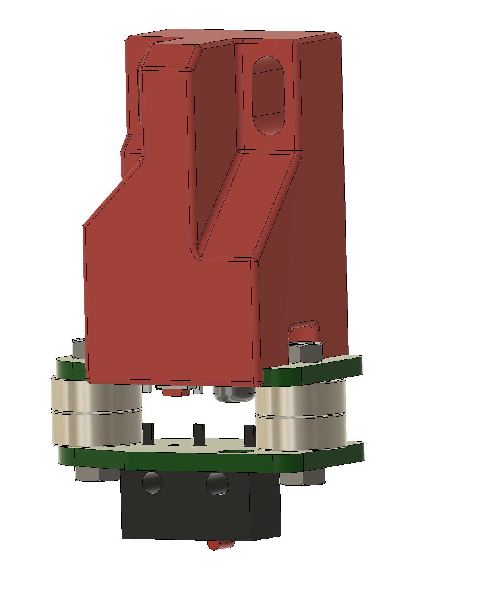
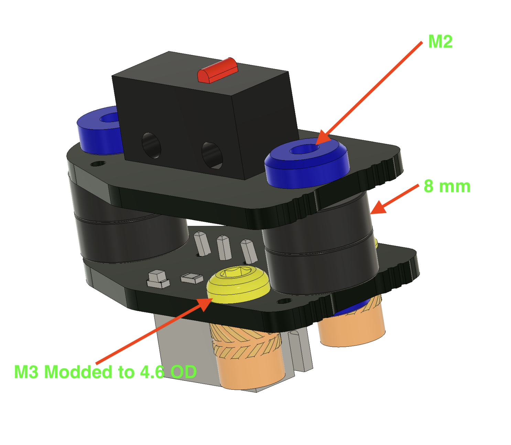

# EuroProbe

## Crossover between Euclid and Klicky, but not sure if I will go on with it and adopt Euclid PCB instead.
To some degree, compatible with both mounting and dock systems.

# I need to redesign the Omron adapters and move the probe mounting holes 1mm to make space for the JST connector, now you have to cut one of the JST walls.
# if moved 1mm to the right, the switch button won't be centered anymore, not a problem but still. You will have two versions if you don't want to cut the JST wall
# It is irrelevant for DuPont connector.

This is the Euclid Probe moded for EU as the original magnets and hardware are non standard and not obtainable in EU, just in US.

Changed are the magnets to 8mm South and North pole.

All STL's have correct print orientation and no need for supports. 
Trident_8mm_ProbeDock.stl needs supports, will change it later and add build in support.

### Mounting the top PCB to Afterburner adapter:
- 2x M2x10mm BHCS self taping 

or

- 2x M2x8 and 2xM2 heat inserts (5mm OD and 4.5mm lenght)

or

- 2x [M3 BHCS with modded head to 4.6 OD](https://github.com/VoronMods/V1/blob/main/Euro_Probe/Images/PIC_5.png), self taping or heat inserts (all adapters in STL)

### Installing magnets:
- 4x M2x5mm FHCS 
- 4x M2 nuts, you can also just screw direct in to the PCB. There is enough friction to hold it secure as PCS is glass fiber.

### Added dock for the Klicky mount. Not tested yet.
For the mount STL in picture, you don't need the red spacer.
With the other Klicky mounts, there is not enough clearance, therefore you need to use a 5 mm spacer (red in the pic), or 3 mm spacer for the side mount.

To install the dock you will need:

- 2x M3x8-10mm

- or
 
- 2x M3x16-18mm if you use the 5 mm spacer

- or
 
- 2x M3x12-16mm if you use the 3 mm spacer

Klicky repo:
https://github.com/jlas1/Klicky-Probe

If you want to integrate the probe in to the new carriage, let me know. I will upload after is done.

Omron Adapter for Afterburner/Stealthburner designed from scratch to fit the 8mm magnets and other changes.

Original is here
https://github.com/nionio6915/Euclid_Probe/
