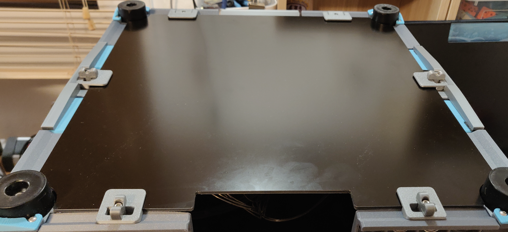
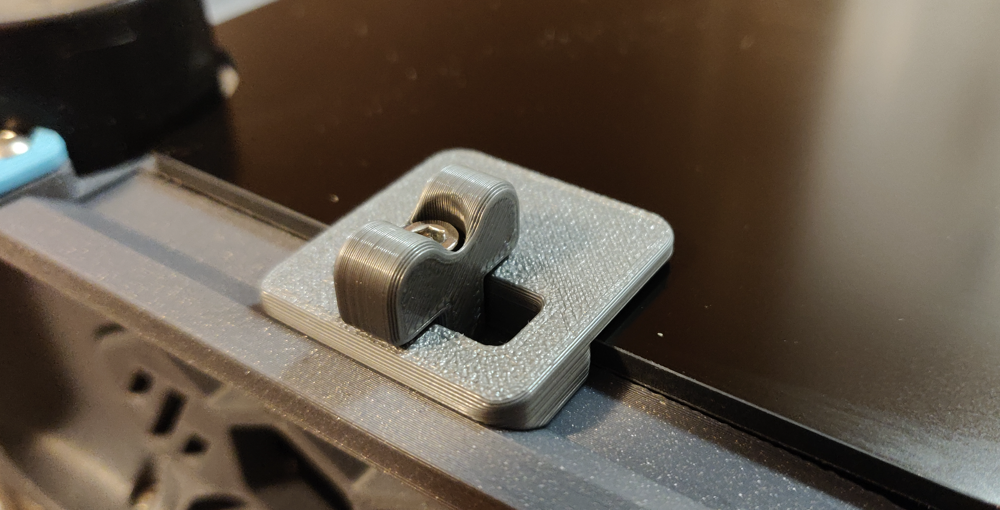
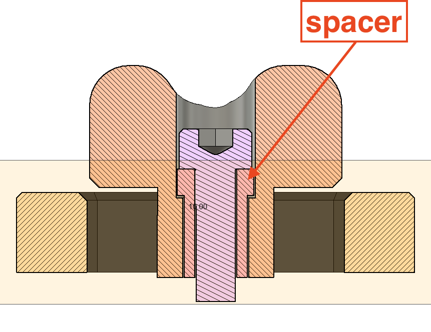

Quick Release Panel Clips  

4x M3x12mm 

2x Side Cklips 
2x Front Clips  
4x Spacers 
4x Lever  

Make sure the heat inserts are flush with the skirt.

If you wonder why the spacer, it is to prevent the M3x12 to turn and get loose while securing the "wing nut".
You can adjust the tension of the "wing nut" and still be able to move it.

