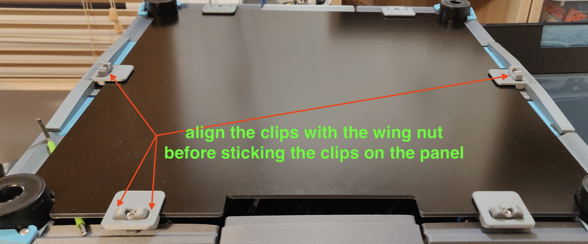
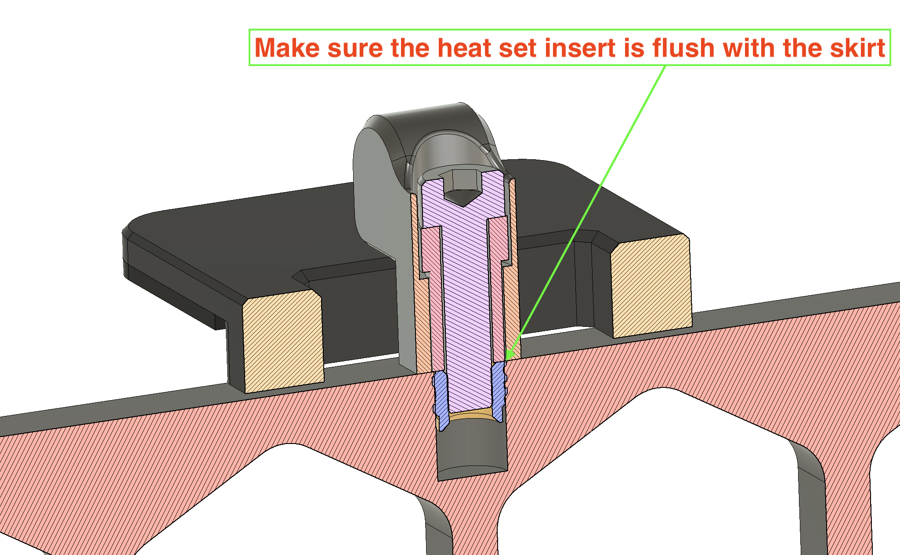

Quick Release Panel Clips  

4x M3x12mm (M3x16mm should also fit)

2x Side Cklips 
2x Front Clips  
4x Spacers 
4x Lever  
Use the original hinges or two extra front clips.

Make sure the heat inserts are flush with the skirt.

If you wonder why the spacer, it is to prevent the M3x12 to turn and get loose while securing the "wing nut".
You can adjust the tension of the "wing nut" and still be able to move it.

My clips are PLA, can be printed with any filament, how the spacer and lever fits in the clip depends on how is you printer calibrated.

To align the clip with the wing nut before sticking the clip on the panel, make sure all is aligned.
Insert an allan key or something similar between the panel and skirt, align the clip and stick to the panel.

