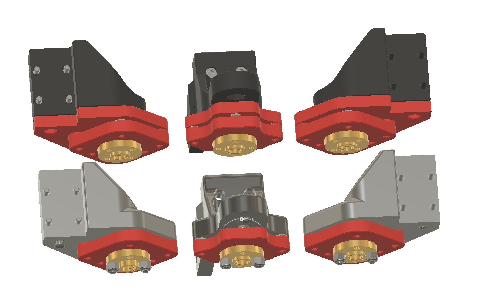

Trident Z Anti Wobbler

Two version:
- Integrated - the top part is integrated in to the Z carriage.
- Retrofit - if you don't want to reprint the Z carriage and just want to try it out, but 10mm less Z travle.

Extra Hardware Needed:
- 9x 4mm ballbering balls, same as in a 608 bearing. 5mm also could be used.
- 30x 3x6mm neodym magnets.
- 6x SHCS M3x12mm for the retrofit top part mount. 

More instructions will be added at later point.

